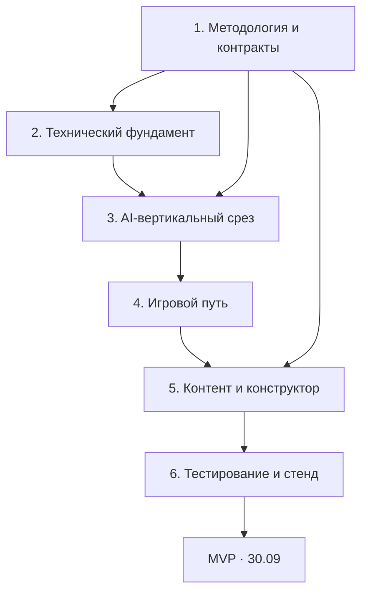

# Арена переговоров

> MVP AI-симулятора переговоров. Демонстрация — **30 сентября 2026 года**.

## Roadmap MVP

### Критический путь

`методические правила → JSON-контракт Evaluator → Game Engine → AI Opponent → игровой чат → финальный PAEI → экран результата → сквозной тест`

| Этап | Результат | Целевая дата |
|---|---|---|
| 1. Решения | Зафиксированы PAEI, состояние, подсказки, завершение и scoring | 17–18.09 |
| 2. Основа | Запускаются frontend, backend и PostgreSQL; есть миграции и healthcheck | 18–19.09 |
| 3. Вертикальный срез | Реплика проходит Evaluator → Engine → Opponent и сохраняется | 20–22.09 |
| 4. Игровой путь | Игрок проходит уровень от вводной до результата | 23–25.09 |
| 5. Конструктор | Администратор создаёт и тестирует уровень; работает кастомная ситуация | 25–27.09 |
| 6. Стабилизация | Контрактные, методические и сквозные тесты; демоданные и стенд | 27–29.09 |
| 7. Демонстрация | Зафиксированная версия MVP | 30.09 |

Подробный план: [`docs/development_plan.md`](docs/development_plan.md).
