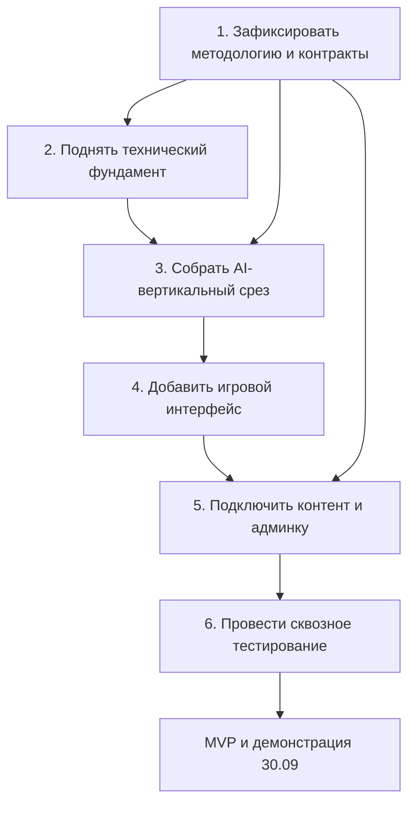

# Арена переговоров

> AI-симулятор рабочих переговоров. MVP для хакатона, срок демонстрации — **30 сентября 2026 года**.

Пользователь ведёт свободный диалог с AI-персонажем, пытается достичь переговорной цели и определить его ведущий профиль PAEI. Система отдельно оценивает действия пользователя, обновляет состояние переговоров и формирует обучающую обратную связь.

## Команда

| Зона | Ответственные |
|---|---|
| Продукт и методология | Полина |
| Техническая реализация | Максим, Данил, Влад |

Точное распределение технических задач фиксируется после сортировки backlog и проверки компетенций и доступности участников.

## Границы MVP

- карьерная линия: **новичок → опытный сотрудник → руководитель → владелец бизнеса**;
- один полностью проходимый сюжет с последовательными уровнями;
- свободный диалог вместо выбора готовых реплик;
- разделение AI Opponent, Evaluator и детерминированного Game Engine;
- состояния переговоров: контакт, сопротивление, продвижение к цели и критические ошибки;
- практика с подсказками и обычная игра без прямых подсказок;
- финальный выбор PAEI и раздельная оценка результата переговоров, качества поведения и учебного результата;
- простой административный конструктор и кастомная переговорная ситуация;
- LLM-провайдер изолирован от игровой логики.

## Структура репозитория

| Путь | Назначение |
|---|---|
| `frontend/` | React + TypeScript + Vite: каталог сюжетов, игровой чат, подсказки, результаты и административные экраны |
| `backend/` | FastAPI: API, Game Engine, AI Opponent, Evaluator, обучающие механики и работа с данными |
| `content/` | Версионируемый контент сюжетов, уровней, персонажей, техник и демонстрационные данные |
| `infrastructure/` | Docker Compose, окружения, развёртывание и CI/CD |
| `docs/product_and_game_design.md` | Продуктовые границы, игровой цикл, режимы и обучающая логика |
| `docs/system_architecture.md` | Общая схема компонентов и их ответственность |
| `docs/database_architecture.md` | Сущности, связи, хранение версий, сессий и ходов |
| `docs/backend_architecture.md` | Модули backend, Game Engine и обработка хода |
| `docs/frontend_architecture.md` | Страницы, состояние интерфейса и взаимодействие с API |
| `docs/llm_architecture.md` | LLM-провайдер, контекст, промпты, structured output и устойчивость |
| `docs/content_and_admin_design.md` | Формат сюжетов, уровней, персонажей и административного конструктора |
| `docs/level_difficulty_design.md` | Методическая и техническая модель сложности |
| `docs/scoring_and_game_state.md` | Состояние переговоров, завершение, scoring и итоговая обратная связь |
| `docs/api_contracts.md` | Контракты frontend/backend и JSON-схемы AI-компонентов |
| `docs/development_plan.md` | Хронология разработки, зависимости, контрольные точки и критерии готовности |

> Архитектурные документы намеренно созданы пустыми. Они заполняются ответственным только в рамках соответствующей задачи и после получения необходимых методологических решений.

## Архитектурный принцип

```text
Реплика пользователя
→ Turn Evaluator
→ проверка структурированного результата
→ Game Engine и обновление состояния
→ AI Opponent
→ сохранение хода
→ ответ и подсказка во frontend
```

Один LLM не должен одновременно играть персонажа, оценивать пользователя и самостоятельно менять состояние игры.

## Roadmap MVP



### Критический путь

`методические правила → JSON-контракт Evaluator → Game Engine → AI Opponent → игровой чат → финальный PAEI → экран результата → сквозной тест`

| Этап | Результат | Целевая дата |
|---|---|---|
| 1. Решения | Зафиксированы PAEI, состояние, подсказки, завершение и scoring | 17–18.09 |
| 2. Основа | Запускаются frontend, backend и PostgreSQL; есть миграции и healthcheck | 18–19.09 |
| 3. Вертикальный срез | Одна реплика проходит Evaluator → Engine → Opponent и сохраняется | 20–22.09 |
| 4. Игровой путь | Игрок проходит уровень от вводной до результата | 23–25.09 |
| 5. Конструктор | Администратор создаёт и тестирует уровень; работает кастомная ситуация | 25–27.09 |
| 6. Стабилизация | Контрактные, методические и сквозные тесты; демоданные и стенд | 27–29.09 |
| 7. Демонстрация | Зафиксированная версия MVP | 30.09 |

Полная последовательность, зависимости и критерии перехода между этапами находятся в [`docs/development_plan.md`](docs/development_plan.md).

## Правила работы

- Не хранить API-ключи и секреты в Git.
- Каждая задача должна иметь критерии готовности и зависимости.
- Методологические решения подтверждает Полина; разработчик помогает формализовать их, а не додумывает молча.
- Новая функциональность начинается с контракта и минимального проверяемого сценария.
- При дефиците времени сначала сохраняется критический вертикальный срез, затем сокращаются второстепенные экраны и удобства.
- Рабочие изменения вносятся через отдельную ветку и Pull Request после формирования команды и Kanban.

## Локальный запуск

Команды запуска появятся после выполнения задач технического фундамента. До этого репозиторий содержит только проектный каркас и план разработки.
