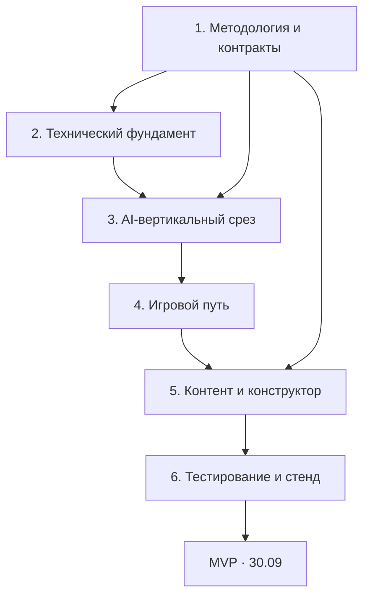

# Арена переговоров

> MVP AI-симулятора переговоров. Демонстрация — **30 сентября 2026 года**.

## Статус: инфраструктура и заглушки

**Backend, frontend и AI пока не являются готовой игрой.**

| Часть | Что уже работает | Что является заглушкой / отсутствует |
|---|---|---|
| БД | 9 таблиц, миграция, ограничения, очистка по сроку | Игровой контент не заполнен |
| Backend | FastAPI, healthcheck, подключение к БД | Нет авторизации, игровых API и обработки ходов |
| Frontend | React/Vite, страница проверки соединения | Нет игрового интерфейса; экран — техническая заглушка |
| AI | Mock и базовый клиент внешнего API | Mock возвращает фиксированный текст; нет Evaluator, Context Builder и Game Engine |

Каркасы добавлены для проверки запуска окружения. Для подготовки одной БД они не нужны:
достаточно конфигурации инфраструктуры и миграции. YAML описывает контейнеры, но сам
по себе не реализует приложения и не заменяет их зависимости или SQL-схему.
Каркасы оставлены для команды, не удалены.
Весь data design: [docs/data_architecture.md](docs/data_architecture.md).

## Windows: Docker и данные на диске E

Установка выполняется **на вашем компьютере**, а не командой Compose.
Для новой установки скачайте [официальный установщик Docker Desktop](https://docs.docker.com/desktop/setup/install/windows-install/)
в `E:\Installers\Docker Desktop Installer.exe`. Проверьте `wsl --version` и требования
на странице Docker; при отсутствии WSL сначала настройте его по этой инструкции.

Запустите PowerShell от администратора:

```powershell
Start-Process -FilePath 'E:\Installers\Docker Desktop Installer.exe' -Wait -ArgumentList @(
  'install',
  '--backend=wsl-2',
  '--installation-dir=E:\Docker\Desktop',
  '--wsl-default-data-root=E:\Docker\WSL'
)
```

Это all-users установка: программа — `E:\Docker\Desktop`, диск данных Docker/WSL —
`E:\Docker\WSL`. Флаги описаны в [документации Docker](https://docs.docker.com/desktop/setup/install/windows-install/#installer-flags).
Запустите Docker Desktop, самостоятельно прочитайте и примите лицензию, если согласны.
До запуска проекта проверьте в настройках расположение диска данных: оно должно быть на E:.
Затем в новом терминале выполните `docker version` и `docker compose version`.

Если Docker уже установлен, **не переустанавливайте и не удаляйте его данные вслепую**:
сначала проверьте текущую конфигурацию и сделайте резервную копию.
Пользовательские настройки Windows могут остаться на C:; установка на E: не означает
полного отсутствия служебных файлов на системном диске.

Исходники проекта также клонируйте на E:, например:

```powershell
New-Item -ItemType Directory -Force E:\Projects
Set-Location E:\Projects
git clone --branch ms/data_architecture_and_docker-18.09.2026 https://github.com/ILmanness/team_Komanda.git
Set-Location team_Komanda
```

Named volumes `postgres_data` и `frontend_modules`, образы и слои контейнеров хранятся
в диске данных Docker. Поэтому перенос только репозитория на E: недостаточен:
размещение диска Docker нужно задать отдельно, как выше. Пути вида `/var/lib/docker`
внутри Linux не показывают букву физического диска Windows.

## Быстрый запуск

Нужны Git и Docker Engine с Compose v2 (либо Docker Desktop с Linux containers).
Python, Node и PostgreSQL на компьютере устанавливать не нужно.

```bash
git clone --branch ms/data_architecture_and_docker-18.09.2026 https://github.com/ILmanness/team_Komanda.git
cd team_Komanda
cp .env.example .env
# Замените POSTGRES_PASSWORD в .env перед первым запуском.
docker compose up --build -d
docker compose ps -a
```

В PowerShell вместо `cp` можно выполнить `Copy-Item .env.example .env`.
Первый запуск скачивает образы и зависимости и требует доступа к их реестрам.
Дождитесь healthy у db, backend и frontend. У migrate нормальный статус — Exited (0).

| Адрес | Что открывается |
|---|---|
| http://localhost:5173 | React-приложение со статусом backend/БД |
| http://localhost:8000/docs | Swagger API |
| http://localhost:8000/health/live | Жив ли backend |
| http://localhost:8000/health/ready | Подключение к БД и наличие миграции |
| localhost:5432 | PostgreSQL для локального SQL-клиента |

Это **окружение разработки**, не готовая игра и не production-deployment.
Пока реализованы схема, миграция, очистка, healthcheck, frontend-каркас и AI-адаптер.
Авторизация, игровые endpoint'ы, Context Builder, Evaluator и Game Engine ещё не реализованы.
Readiness не вызывает платный API и не подтверждает доступность внешней модели.

## Что запускает Compose

| Сервис | Назначение |
|---|---|
| `db` | PostgreSQL 17, автоматически создаёт БД из POSTGRES_DB |
| `migrate` | Применяет Alembic-миграции до запуска приложений |
| `backend` | Python 3.12, FastAPI, Pydantic, SQLAlchemy, psycopg, HTTPX для AI |
| `cleanup` | Тот же Python-образ, периодическая очистка завершённых сессий |
| `frontend` | Node 22, React, TypeScript, Vite, React Router |

Это несколько контейнеров в одном Compose-проекте, с общей сетью и запуском одной командой.
AI-клиент находится внутри backend, отдельный AI-сервер не нужен. Веса локальной модели,
CUDA, Redis и векторная БД не устанавливаются: для выбранной архитектуры они пока не нужны.
Тестовые зависимости включены в dev-образы: pytest, Ruff, Vitest и React Testing Library.
Точные версии фиксируются в `backend/requirements.lock` и `frontend/package-lock.json`.

Порядок запуска: healthy PostgreSQL → успешная миграция → backend/cleanup → frontend.
Условия запуска соответствуют [документации Docker Compose](https://docs.docker.com/compose/how-tos/startup-order/).

## Работа внутри контейнеров

```bash
docker compose exec backend sh
docker compose exec frontend sh
docker compose exec db sh
docker compose logs -f backend frontend cleanup
```

Код backend/frontend примонтирован с компьютера. Редактируйте файлы в IDE: backend
перезапускается через `--reload`, Vite обновляет страницу. Пересборка нужна при изменении зависимостей.
`node_modules` хранится в отдельном volume, а не смешивается с Windows/macOS-зависимостями.

Внутри Docker хост БД — `db`, порт — `5432`. На компьютере хост — `localhost`, порт — `DB_PORT`.
Для SQL-консоли (команда использует настройки самого контейнера):

```bash
docker compose exec db sh -c 'psql -U "$POSTGRES_USER" -d "$POSTGRES_DB"'
```

Внутри psql: `\dt` покажет таблицы, `\d game_sessions` — поля, `\q` — выход.
После старта будут 9 таблиц приложения и служебная `alembic_version`.
Контент и пользователи автоматически не создаются: методические данные команда заполнит отдельно.

## Схема и миграции

Описание: [docs/data_architecture.md](docs/data_architecture.md).
Точная начальная схема: [0001_initial.sql](backend/migrations/versions/0001_initial.sql).

- Все подготовленные задания — `missions`, карта строится по storyline_id/branch_key/order_index.
- Темы, методики и статьи — иерархическая `knowledge_items`.
- PAEI и сложность — отдельные справочники.
- Custom не создаёт миссию: параметры хранятся в сессии.
- Удаление сессии каскадно удаляет её сообщения.

Если нужны только БД и таблицы без заглушек backend/frontend/AI:

```bash
docker compose up -d db
docker compose run --rm migrate
```

Эти команды не запускают frontend, API и автоматическую очистку.
Для автоматической очистки отдельно выполните `docker compose up -d cleanup`.

```bash
docker compose run --rm migrate
docker compose exec backend alembic current
docker compose exec backend alembic revision -m "describe change"
```

Новую миграцию редактируют вручную; ORM-моделей для autogenerate пока нет.
Не изменяйте уже применённую `0001`: для следующих изменений добавляйте новую миграцию.
Схема не завязана на `/docker-entrypoint-initdb.d`: миграции работают и с существующим volume.
После `git pull` для обновления окружения повторите `docker compose up --build -d`.

## Срок хранения сессий и диалогов

Это обычные таблицы с ограниченным сроком хранения, **не SQL TEMP TABLE**:
[в PostgreSQL временная таблица принадлежит соединению](https://www.postgresql.org/docs/17/sql-createtable.html),
а игровая сессия должна переживать переподключения и перезапуск backend.

| Переменная `.env` | По умолчанию | Поведение |
|---|---:|---|
| `HISTORY_RETENTION_DAYS` | 7 | После завершения удалить сообщения, state, memory, custom_context и config_snapshot |
| `SESSION_RETENTION_DAYS` | 30 | После завершения удалить саму сессию вместе с final_result |
| `ACTIVE_SESSION_IDLE_DAYS` | 30 | Неактивную сессию пометить abandoned; сроки очистки начнутся с этого момента |
| `RETENTION_INTERVAL_SECONDS` | 3600 | Период между пакетами очистки |

Для очистки на ближайшем проходе после завершения выставьте соответствующий срок в 0.
Срок хранения сессии не может быть меньше срока хранения истории.
В каждом проходе обрабатывается до 200 записей каждого типа; при большой очереди очистка займёт несколько проходов.
Активные недавно использованные сессии не чистятся. Будущий обработчик ходов обязан
обновлять `last_activity_at`, проверять status/lock_version и работать с блокировкой строки сессии.
Истёкшую или очищенную сессию продолжать нельзя — требуется новая.

Важно: после удаления сессии исчезают её результаты. Долговременный прогресс сюжетки,
достижения и статистика пока не реализованы и не должны вычисляться из уже очищенной истории.
Если они нужны, до включения игры добавьте отдельное долговременное хранение прогресса.
До удаления сессии `final_result` может содержать текст обратной связи — это не обещание
полного удаления всех личных данных через 7 дней. Резервные копии имеют отдельный срок хранения.

Просмотр кандидатов и ручной запуск:

```bash
docker compose exec backend python -m app.retention
docker compose exec backend python -m app.retention --apply
docker compose logs cleanup
```

Без `--apply` транзакция откатывается и данные остаются. С `--apply` удаление необратимо
без резервной копии. Автоматический cleanup запускается с `--apply`.
После изменения `.env`: `docker compose up -d --force-recreate backend cleanup`.

## Подключение AI

По умолчанию `AI_PROVIDER=mock`: окружение запускается без ключа, ответ отмечен `[MOCK]`.
Для провайдера с совместимым `/chat/completions` укажите в `.env`:

```dotenv
AI_PROVIDER=compatible
AI_BASE_URL=https://your-provider.example/v1
AI_API_KEY=your-private-key
AI_MODEL=provider-model-id
AI_TIMEOUT_SECONDS=30
```

После изменения пересоздайте backend и cleanup. Пробный вызов (в compatible-режиме может стоить денег):

```bash
docker compose exec backend python -m app.ai
```

Базовый адаптер реализует текстовый запрос и timeout. JSON-контракт Evaluator,
prompt-версии и восстановление игрового хода описаны в архитектуре, но ещё не реализованы.
Ключ находится только в backend-окружении; не добавляйте его в `VITE_*`, git или Dockerfile.

## Проверки

```bash
docker compose exec backend pytest -q
docker compose exec backend ruff check app tests migrations
docker compose exec -e RUN_DB_TESTS=1 backend pytest -q
docker compose exec frontend npm run build
docker compose exec frontend npm test
```

DB-тесты создают уникальную схему `arena_test_*` внутри dev-БД и удаляют только её.
Они проверяют ограничения, каскадное удаление, dry-run, очистку и сохранение активной истории.
Не запускайте их с production-реквизитами. Проверка всего стека: `sh infrastructure/smoke.sh`.

Обновление зависимостей выполняйте осознанно с пересозданием lock-файлов:

```bash
# frontend: обновить package.json, затем
docker compose exec frontend npm install
# backend: обновить requirements.in, локально с установленным uv
uv pip compile backend/requirements.in -o backend/requirements.lock --python-version 3.12
docker compose up --build -d
```

## Остановка, резервная копия и ограничения

```bash
docker compose stop
docker compose start
docker compose down
```

Эти команды сохраняют volume PostgreSQL. **`docker compose down -v` удалит БД и node_modules-volume**;
используйте только если действительно хотите уничтожить локальные данные.
Пример резервной копии в Bash (сохраните файл вне git):

```bash
docker compose exec -T db sh -c 'pg_dump -U "$POSTGRES_USER" -d "$POSTGRES_DB"' > arena-backup.sql
```

Порты опубликованы только на 127.0.0.1. Для общего стенда понадобятся TLS, авторизация,
ограничения доступа, отдельный непривилегированный пользователь приложения в БД и production-образы.
В dev `POSTGRES_USER` используется также приложением и имеет права создания схем для миграций.
Смена пароля в `.env` не меняет пароль уже созданного PostgreSQL-volume: измените его SQL-командой
в БД и затем обновите `.env`, не удаляйте volume ради смены пароля.
Если порт занят, измените DB_PORT/BACKEND_PORT/FRONTEND_PORT в `.env`.

## Roadmap MVP



### Критический путь

`методические правила → JSON-контракт Evaluator → Game Engine → AI Opponent → игровой чат → финальный PAEI → экран результата → сквозной тест`

| Этап | Результат | Целевая дата |
|---|---|---|
| 1. Решения | Зафиксированы PAEI, состояние, подсказки, завершение и scoring | 17–18.09 |
| 2. Основа | Запускаются frontend, backend и PostgreSQL; есть миграции и healthcheck | 18–19.09 |
| 3. Вертикальный срез | Реплика проходит Evaluator → Engine → Opponent и сохраняется | 20–22.09 |
| 4. Игровой путь | Игрок проходит уровень от вводной до результата | 23–25.09 |
| 5. Конструктор | Администратор создаёт и тестирует уровень; работает кастомная ситуация | 25–27.09 |
| 6. Стабилизация | Контрактные, методические и сквозные тесты; демоданные и стенд | 27–29.09 |
| 7. Демонстрация | Зафиксированная версия MVP | 30.09 |

Подробный план: [`docs/development_plan.md`](docs/development_plan.md).
