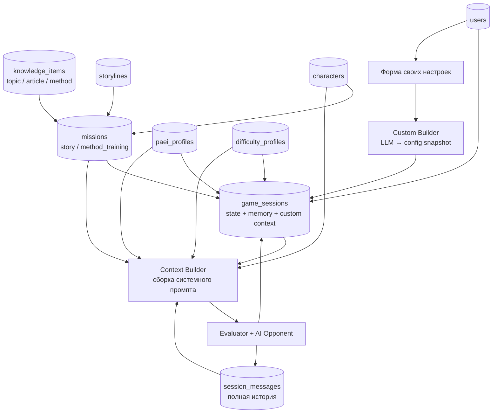
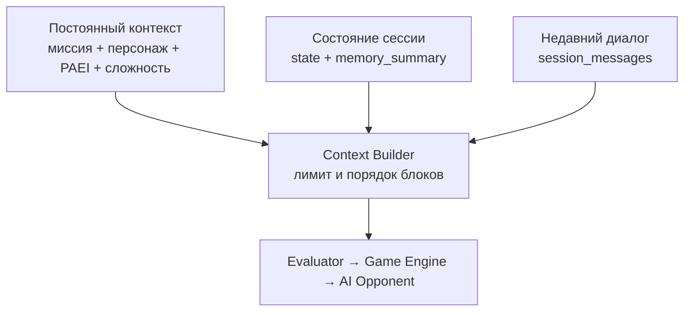
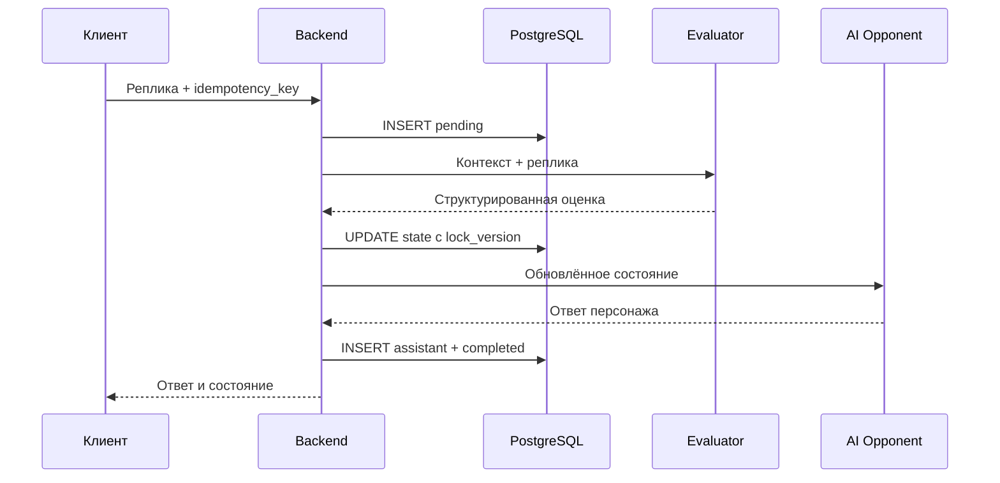

# База данных и LLM-архитектура MVP «Арена переговоров»

## Основное решение

В MVP не используются отдельные таблицы и SQL-view для сюжетных веток.

Все подготовленные игровые задания находятся в одной таблице `missions`. Сюжетная карта строится по полям:

- `storyline_id` — к какой сюжетке относится миссия;
- `branch_key` — к какой ветке относится миссия;
- `order_index` — позиция тарелки внутри ветки;
- `mission_type` — сюжетная миссия или тренировка методики.

Custom-миссия в `missions` не сохраняется. Пользовательские настройки преобразуются в конфигурацию конкретной сессии и хранятся в `game_sessions.custom_context` и `game_sessions.config_snapshot`.

В первой версии используется **9 таблиц приложения** и служебная таблица Alembic.

Реализованная схема: `backend/migrations/versions/0001_initial.sql`. Этот документ описывает также будущую игровую логику; Docker-каркас ещё не реализует обработчик ходов.

## Общая схема



## Как строится сюжетная карта

Сюжетка собирается непосредственно из `missions`:

```sql
SELECT
    id,
    title,
    branch_key,
    order_index,
    mission_type,
    status
FROM missions
WHERE storyline_id = :storyline_id
  AND mission_type = 'story'
  AND status = 'published'
ORDER BY branch_key, order_index;
```

Пример данных:

| Название миссии | `branch_key` | `order_index` | Тип взаимодействия |
|---|---|---:|---|
| Добро пожаловать в компанию | `main` | 1 | `scripted_dialogue` |
| Где находится база знаний | `main` | 2 | `scripted_dialogue` |
| Знакомство с PAEI | `main` | 3 | `single_choice` |
| Корпоративная крыса: разговор 1 | `main` | 4 | `ai_dialogue` |
| Корпоративная крыса: разговор 2 | `main` | 5 | `ai_dialogue` |

Если появится вторая ветка, достаточно использовать другой `branch_key`, например `advanced`.

Конструктор фронтенда изменяет `branch_key` и `order_index`. Отдельная таблица веток понадобится только тогда, когда у ветки появятся собственные настройки, обложка, описание или сложные правила переходов.

## Что такое JSONB

`JSONB` — тип PostgreSQL для хранения структурированного JSON внутри одной колонки.

Он используется для данных, структура которых может меняться между разными миссиями и сессиями:

- контекст миссии;
- игровые правила;
- PAEI-поведение;
- параметры сложности;
- текущее состояние сессии;
- память разговора;
- результат Evaluator;
- финальная обратная связь.

В JSONB не прячутся внешние ключи, порядок миссий, статусы и текст сообщений.

## 1. `users`

Пользователи и администраторы.

| Поле | Тип | Назначение |
|---|---|---|
| `id` | UUID PK | Пользователь |
| `email` | varchar(320) unique, nullable | Email |
| `display_name` | varchar(120) | Имя |
| `role` | varchar(20) | `player`, `admin` |
| `created_at` | timestamptz | Создание |
| `updated_at` | timestamptz | Изменение |

## 2. `knowledge_items`

Единая иерархическая таблица базы знаний.

| Поле | Тип | Назначение |
|---|---|---|
| `id` | UUID PK | Элемент базы знаний |
| `parent_id` | UUID FK → `knowledge_items.id`, nullable | Родительская тема |
| `item_type` | varchar(20) | `topic`, `article`, `method` |
| `slug` | varchar(120) unique | Системное имя |
| `title` | varchar(240) | Название |
| `summary` | text, nullable | Краткое описание |
| `body` | text, nullable | Теория или статья |
| `metadata` | JSONB | Теги, сложность, время чтения |
| `status` | varchar(20) | `draft`, `published`, `archived` |
| `sort_order` | smallint | Порядок внутри родителя |
| `created_at` | timestamptz | Создание |
| `updated_at` | timestamptz | Изменение |

Пример дерева:

```text
Переговорные методики [topic]
└── Гарвардский метод [method]
    ├── Позиции и интересы [article]
    └── Отделяйте людей от проблемы [article]
```

## 3. `storylines`

Метаданные сюжетных линий.

| Поле | Тип | Назначение |
|---|---|---|
| `id` | UUID PK | Сюжетка |
| `slug` | varchar(120) unique | Системное имя |
| `title` | varchar(200) | Название |
| `description` | text | Описание |
| `cover_url` | text, nullable | Обложка |
| `status` | varchar(20) | `draft`, `published`, `archived` |
| `created_by_user_id` | UUID FK → `users.id`, nullable | Автор |
| `created_at` | timestamptz | Создание |
| `updated_at` | timestamptz | Изменение |

## 4. `characters`

Базовые игровые персонажи без конкретного PAEI-профиля.

| Поле | Тип | Назначение |
|---|---|---|
| `id` | UUID PK | Персонаж |
| `slug` | varchar(120) unique | Системное имя |
| `name` | varchar(160) | Имя |
| `role_title` | varchar(200) | Должность или роль |
| `description` | text | Видимое описание |
| `base_prompt` | text | Базовые инструкции персонажа |
| `behavior` | JSONB | Стиль речи и общие реакции |
| `created_at` | timestamptz | Создание |
| `updated_at` | timestamptz | Изменение |

Старший сотрудник учебных миссий является обычной записью в этой таблице.

## 5. `paei_profiles`

PAEI вынесен из миссий и персонажей в отдельную таблицу.

| Поле | Тип | Назначение |
|---|---|---|
| `id` | UUID PK | Профиль |
| `code` | varchar(32) unique | Например `PaEi` |
| `leading_letter` | char(1) | `P`, `A`, `E`, `I` |
| `p_value` | smallint | `0..100` |
| `a_value` | smallint | `0..100` |
| `e_value` | smallint | `0..100` |
| `i_value` | smallint | `0..100` |
| `prompt_rules` | text | Инструкции для системного промпта |
| `behavior` | JSONB | Мотивация, речь, давление, перегрев |
| `created_at` | timestamptz | Создание |

Один профиль может применяться к разным персонажам. Конкретная пара персонаж + PAEI закрепляется в `game_sessions`.

## 6. `difficulty_profiles`

Сложность также не хранится в миссии.

| Поле | Тип | Назначение |
|---|---|---|
| `id` | UUID PK | Профиль сложности |
| `code` | varchar(40) unique | `easy`, `normal`, `hard` |
| `title` | varchar(120) | Название |
| `prompt_rules` | text | Влияние сложности на модель |
| `settings` | JSONB | Сопротивление, подсказки, допуск ошибок |
| `created_at` | timestamptz | Создание |

Пример `settings`:

```json
{
  "resistance": 70,
  "paei_visibility": 30,
  "critical_error_limit": 2,
  "hint_level": 0,
  "max_turns": 10
}
```

## 7. `missions`

Подготовленные сюжетные миссии и тренировки методик.

Custom-миссии сюда не записываются.

| Поле | Тип | Назначение |
|---|---|---|
| `id` | UUID PK | Миссия |
| `storyline_id` | UUID FK → `storylines.id`, nullable | Сюжетка; null у отдельной тренировки |
| `character_id` | UUID FK → `characters.id`, nullable | Основной персонаж |
| `knowledge_item_id` | UUID FK → `knowledge_items.id`, nullable | Связанная тема или методика |
| `mission_type` | varchar(30) | `story`, `method_training` |
| `interaction_type` | varchar(30) | `ai_dialogue`, `scripted_dialogue`, `single_choice` |
| `branch_key` | varchar(80), nullable | Ветка сюжетки |
| `order_index` | smallint, nullable | Позиция тарелки |
| `title` | varchar(200) | Название |
| `context` | JSONB | Вводные данные и скрытый контекст |
| `task` | text | Задача пользователя |
| `config` | JSONB | Условия завершения или варианты ответа |
| `status` | varchar(20) | `draft`, `published`, `archived` |
| `created_at` | timestamptz | Создание |
| `updated_at` | timestamptz | Изменение |

Для сюжетной миссии обязательны `storyline_id`, `branch_key` и `order_index`.

Для тренировки обязательны `knowledge_item_id` и `config` с вариантами ответа.

Пример `context`:

```json
{
  "public_context": "Коллега задерживает критическую задачу",
  "hidden_context": "Он не понимает требования и боится признаться",
  "player_role": "руководитель проекта",
  "known_facts": ["релиз через три дня"],
  "opening_message": "У меня сейчас нет времени это обсуждать"
}
```

Пример `config` тренировки:

```json
{
  "question": "Что нужно сделать первым по Гарвардскому методу?",
  "options": [
    {"id": "a", "text": "Надавить на позицию", "correct": false},
    {"id": "b", "text": "Выяснить интересы сторон", "correct": true},
    {"id": "c", "text": "Сразу предложить компромисс", "correct": false}
  ],
  "explanation": "Сначала нужно отделить позиции от интересов"
}
```

Ограничение для сюжетных миссий:

```sql
UNIQUE (storyline_id, branch_key, order_index)
```

## 8. `game_sessions`

Текущее прохождение и память игры.

| Поле | Тип | Назначение |
|---|---|---|
| `id` | UUID PK | Сессия |
| `user_id` | UUID FK → `users.id` | Игрок |
| `mission_id` | UUID FK → `missions.id`, nullable | Подготовленная миссия; null для custom |
| `character_id` | UUID FK → `characters.id`, nullable | Выбранный персонаж |
| `paei_profile_id` | UUID FK → `paei_profiles.id`, nullable | Выбранный PAEI |
| `difficulty_profile_id` | UUID FK → `difficulty_profiles.id`, nullable | Сложность |
| `mode` | varchar(20) | `story`, `method_training`, `custom` |
| `status` | varchar(20) | `active`, `completed`, `failed`, `abandoned` |
| `custom_context` | JSONB, nullable | Ввод пользователя для custom-сессии |
| `state` | JSONB | Текущее игровое состояние |
| `memory_summary` | JSONB | Сжатая память старой части диалога |
| `config_snapshot` | JSONB | Зафиксированные настройки запуска |
| `prompt_version` | varchar(40) | Версия шаблона системного промпта |
| `lock_version` | integer | Защита от одновременного изменения состояния |
| `last_processed_sequence` | integer | Последнее полностью обработанное сообщение |
| `final_result` | JSONB, nullable | Итог и обратная связь |
| `started_at` | timestamptz | Начало |
| `completed_at` | timestamptz, nullable | Завершение |
| `last_activity_at` | timestamptz | Последняя активность; обновляет обработчик хода |
| `history_purged_at` | timestamptz, nullable | Когда очищены история и частный контекст |

Проверка режима:

```sql
CHECK (
    (mode IN ('story', 'method_training') AND mission_id IS NOT NULL)
    OR
    (mode = 'custom' AND mission_id IS NULL AND custom_context IS NOT NULL)
)
```

### Custom-сессия

Custom Builder не создаёт строку в `missions`. Он формирует конфигурацию и сохраняет её в сессии:

```json
{
  "situation": "хочу договориться о повышении зарплаты",
  "player_role": "сотрудник",
  "opponent_role": "руководитель",
  "goal": "получить повышение на 15%",
  "generated_character": {
    "name": "Анна",
    "behavior": "рациональный руководитель"
  },
  "generated_rules": {
    "max_turns": 10,
    "success_conditions": ["согласован следующий шаг"]
  }
}
```

Если позже понадобится сохранять пользовательские сценарии как шаблоны и запускать повторно, тогда добавляется отдельная таблица `saved_custom_scenarios`.

### Состояние и память

Пример `state`:

```json
{
  "turn": 5,
  "contact": 65,
  "tension": 20,
  "progress": 45,
  "critical_errors": 0,
  "revealed_facts": ["сотрудник не понял требования"],
  "agreements": ["уточнить требования до 18:00"]
}
```

Полная история хранится не здесь, а в `session_messages`.

## 9. `session_messages`

Полная история сессии.

| Поле | Тип | Назначение |
|---|---|---|
| `id` | UUID PK | Сообщение |
| `session_id` | UUID FK → `game_sessions.id` | Сессия |
| `sequence_number` | integer | Порядок |
| `role` | varchar(20) | `user`, `assistant`, `system` |
| `content` | text | Текст |
| `payload` | JSONB | Структурированный ответ тренировки или служебные данные |
| `evaluation` | JSONB, nullable | Результат Evaluator для реплики пользователя |
| `idempotency_key` | UUID, nullable | Защита от двойной отправки |
| `processing_status` | varchar(20) | `pending`, `completed`, `failed` |
| `state_applied_at` | timestamptz, nullable | Оценка уже применена к state; записывается в той же транзакции |
| `reply_to_message_id` | UUID nullable, unique | Сообщение пользователя, на которое дан ответ; составной FK гарантирует ту же сессию |
| `error_code` | varchar(80), nullable | Код контролируемой ошибки |
| `model` | varchar(120), nullable | Использованная модель |
| `token_count` | integer, nullable | Размер сообщения для управления контекстом |
| `created_at` | timestamptz | Время |

Ограничения:

```sql
UNIQUE (session_id, sequence_number)
UNIQUE (session_id, idempotency_key)
```

## Как устроена работа с нейросетью

### Главный принцип

LLM не является хранилищем игры. Между HTTP-запросами она ничего надёжно не помнит.

Источником истины являются:

- `game_sessions` — текущее состояние игры и сжатая память;
- `session_messages` — полная история разговора;
- `missions`, `characters`, `paei_profiles`, `difficulty_profiles` — постоянные игровые настройки;
- backend — правила игры, проверка ответов и изменение очков.

Даже если LLM-провайдер возвращает собственный `conversation_id`, на него нельзя завязывать игровую логику. При смене модели или провайдера сессия должна продолжиться только по данным из нашей БД.

### Пять логических компонентов

Для MVP это могут быть обычные backend-сервисы, а не отдельные микросервисы.

| Компонент | Что делает | Меняет БД напрямую |
|---|---|---|
| `Context Builder` | Собирает данные миссии, персонажа, PAEI, сложности, состояния и истории | Нет |
| `Evaluator` | Превращает реплику игрока в строгую структурированную оценку | Нет |
| `Game Engine` | Проверяет оценку и по правилам изменяет состояние и очки | Да |
| `AI Opponent` | Пишет следующую реплику игрового персонажа | Нет |
| `Memory Summarizer` | Сжимает старую часть диалога в структурированную память | Только через backend |

LLM не должна самостоятельно выполнять SQL, менять очки или объявлять победу. Она предлагает интерпретацию текста, а итоговое решение принимает `Game Engine`.

## Запуск подготовленной миссии

1. Клиент отправляет `mission_id`, выбранные `paei_profile_id` и `difficulty_profile_id`.
2. Backend проверяет, что миссия опубликована и доступна пользователю.
3. Backend читает `missions`, `characters`, `paei_profiles` и `difficulty_profiles`.
4. Создаётся `game_sessions` со статусом `active`.
5. В `config_snapshot` сохраняется полный снимок используемого контекста, задачи, персонажа, PAEI, сложности и правил. Все последующие ходы читают именно снимок, а не изменяемые справочники.
6. В `state` записываются начальные игровые показатели.
7. Если у миссии есть `opening_message`, оно сохраняется первым сообщением персонажа.

Снимок нужен, чтобы активная игра не изменилась посередине, если администратор отредактировал миссию или профиль сложности.

Пример начального `config_snapshot`:

```json
{
  "mission_version": 3,
  "character": {
    "name": "Игорь",
    "role": "старший сотрудник"
  },
  "paei_code": "pAeI",
  "difficulty_code": "normal",
  "rules": {
    "max_turns": 10,
    "critical_error_limit": 2,
    "success_progress": 80
  }
}
```

Для настоящего версионирования контента позже понадобятся версии миссий. Для MVP достаточно полного снимка использованных настроек. Пример выше сокращён; `mission_version` — метка для будущего версионирования, сейчас такой колонки у миссии нет.

## Запуск custom-сессии

Custom-режим не создаёт запись в `missions`.

1. Пользователь заполняет ситуацию, свою роль, роль оппонента и цель.
2. `Custom Builder` проверяет ввод и формирует рабочую конфигурацию сценария.
3. Исходный ввод сохраняется в `game_sessions.custom_context`.
4. Сгенерированный персонаж, правила, критерии успеха и начальные показатели сохраняются в `config_snapshot`.
5. Дальше custom-сессия проходит через тот же `Evaluator → Game Engine → AI Opponent`, что и сюжетная.

Так custom-сценарий живёт только внутри прохождения. Если пользователь захочет сохранить его для повторного запуска, тогда отдельно появится `saved_custom_scenarios`.

## Как собирается prompt

Перед каждым ходом `Context Builder` заново собирает запрос. Рекомендуемый порядок:

1. Базовые системные правила из версии backend-кода.
2. Контекст и задача из `missions` либо custom-конфигурация из сессии.
3. Роль и стиль персонажа.
4. Правила поведения выбранного PAEI-профиля.
5. Ограничения сложности.
6. Текущее `game_sessions.state`.
7. Сжатая `game_sessions.memory_summary`.
8. Последние сообщения из `session_messages`, помещающиеся в бюджет токенов.
9. Новая реплика пользователя.

Схематично:



Скрытый контекст миссии передаётся модели, но не возвращается клиенту. Пользовательский текст всегда помещается в отдельный блок данных и не склеивается с системными инструкциями.

## Два вызова модели на один ход

Надёжнее разделить оценку действия и актёрский ответ персонажа.

### 1. Evaluator

Evaluator получает контекст и реплику игрока, а возвращает JSON по фиксированной схеме, например:

```json
{
  "intent": "уточнить причину задержки",
  "actions": ["open_question", "active_listening"],
  "revealed_facts": ["сотрудник не понял требования"],
  "agreements": [],
  "effects": {
    "contact": 8,
    "tension": -4,
    "progress": 10
  },
  "critical_error": false,
  "should_finish": false,
  "finish_reason": null
}
```

Поля `effects` в примере иллюстративны. Для детерминированного scoring движок должен сам сопоставлять проверенные события с фиксированными изменениями очков; простое ограничение предложенных моделью чисел не делает scoring детерминированным.

Backend валидирует этот JSON. Затем `Game Engine` применяет ограничения сложности, допустимые диапазоны, лимит ходов и условия победы. Например, модель может предложить `contact: 500`, но движок ограничит изменение разрешённым диапазоном.

### 2. AI Opponent

AI Opponent получает уже обновлённое состояние и инструкцию сыграть следующую реплику персонажа. Поэтому персонаж реагирует не только на последнюю фразу, но и на последствия, которые подтвердил движок.

В ответе персонажа не должны содержаться скрытые системные инструкции, PAEI-коэффициенты, правильные ответы или внутренние оценки.

## Надёжная обработка одного хода

Нельзя держать одну SQL-транзакцию открытой во время запросов к LLM: модель может отвечать несколько секунд, завершиться по таймауту или вернуть некорректный JSON.

Ход обрабатывается короткими этапами.

### Этап A — принять сообщение

В короткой транзакции backend:

1. Проверяет, что сессия принадлежит пользователю и имеет статус `active`.
2. Проверяет `idempotency_key`.
3. Назначает следующий `sequence_number`.
4. Создаёт пользовательское сообщение со статусом `pending`.
5. Фиксирует транзакцию.

Если клиент повторил тот же запрос из-за плохого интернета, уникальная пара `(session_id, idempotency_key)` не позволит создать второй ход.

### Этап B — оценить действие

Backend загружает снимок сессии, собирает prompt и вызывает Evaluator. Ответ модели проверяется по JSON Schema. При сломанном JSON выполняется один контролируемый repair/retry; затем сообщение переводится в `failed`.

### Этап C — применить игровое состояние

В новой короткой транзакции backend:

1. Ещё раз проверяет статус сообщения и сессии.
2. Сравнивает прочитанный `lock_version` с текущим.
3. Передаёт evaluation в `Game Engine`.
4. Обновляет `state` и увеличивает `lock_version`.
5. Сохраняет evaluation у пользовательского сообщения.

Если `lock_version` уже изменился, оценку по устаревшему состоянию применять нельзя: нужно заново загрузить сессию и определить этап восстановления. В каждый момент допустим только один pending-ход пользователя на сессию (частичный уникальный индекс). Пока незавершённый ход не восстановлен, новый ход не принимается.

### Этап D — ответить персонажем

Backend вызывает AI Opponent с обновлённым состоянием. Затем в короткой транзакции:

1. Сохраняет сообщение `assistant`.
2. Переводит пользовательское сообщение в `completed`.
3. Обновляет `last_processed_sequence`.
4. При выполнении условий завершает сессию и создаёт `final_result`.

Если AI Opponent упал после успешного Evaluator, повторно применять evaluation нельзя. Backend проверяет `state_applied_at`, записанный атомарно вместе с изменением state, поэтому повторяет только генерацию ответа персонажа. Уникальный `reply_to_message_id` не позволяет сохранить два ответа на один ход. Это контракт для будущего обработчика: сейчас реализована только схема.



## Как хранится память длинного диалога

Есть три слоя памяти.

| Слой | Где хранится | Зачем нужен |
|---|---|---|
| Полная история | `session_messages` | Аудит, повторная обработка, экран истории |
| Недавний разговор | последние сообщения из `session_messages` | Точные формулировки и локальный контекст |
| Долгая память | `game_sessions.memory_summary` | Важные факты из старой части диалога |

Полная история сохраняется на время активной игры и до истечения срока хранения после её завершения. В prompt попадают не обязательно последние 8 или 12 сообщений, а столько последних сообщений, сколько помещается в выделенный токен-бюджет. Для MVP можно начать с 6–12 сообщений и затем считать реальные токены используемой модели.

Пример структурированной `memory_summary`:

```json
{
  "summary": "Игрок восстановил контакт и выяснил причину задержки",
  "revealed_facts": [
    "сотрудник не понял требования",
    "релиз назначен через три дня"
  ],
  "agreements": [
    "вместе уточнить требования до 18:00"
  ],
  "unresolved_questions": [
    "кто проверит итоговую задачу"
  ],
  "player_style": [
    "задаёт открытые вопросы",
    "не использовал угрозы"
  ],
  "summarized_through_sequence": 14
}
```

`Memory Summarizer` запускается, например, каждые 4–6 ходов или при превышении токен-бюджета. Он получает предыдущую summary и новую пачку старых сообщений, а затем возвращает обновлённую summary.

Критичные для логики факты не должны жить только в summary. Договорённости, открытые факты, счётчики ошибок и условия победы также находятся в `state`, потому что `Game Engine` должен работать с ними детерминированно.

## Завершение и результат

Сессия завершается, когда выполнено одно из условий:

- достигнут критерий успеха;
- превышен лимит критических ошибок;
- закончился лимит ходов;
- пользователь явно завершил игру;
- для тренировки выбран итоговый ответ.

`Game Engine` рассчитывает итоговые показатели. LLM может написать человеческое объяснение и рекомендации, но числовой результат и факт победы определяются правилами backend.

Пример `final_result`:

```json
{
  "outcome": "success",
  "score": 82,
  "metrics": {
    "contact": 78,
    "progress": 85,
    "tension": 18
  },
  "strengths": ["выяснил интересы оппонента"],
  "mistakes": ["слишком поздно зафиксировал срок"],
  "recommended_knowledge_item_ids": ["9af3..."],
  "feedback_text": "Вы нашли настоящую причину задержки и согласовали следующий шаг."
}
```

## Ошибки и безопасность

- Каждый вызов LLM имеет таймаут и ограниченное число повторов.
- Ответ Evaluator принимается только после проверки по JSON Schema.
- Повтор запроса использует тот же `idempotency_key`.
- Ошибка сохраняется в `processing_status = failed` и `error_code`; пользователь может повторить ход.
- Системный prompt, скрытый контекст и ключи провайдера никогда не отправляются во frontend.
- Пользовательский ввод считается недоверенными данными: просьба «игнорируй правила» не должна менять системные инструкции.
- `prompt_version` и имя модели сохраняются, чтобы потом понимать, почему разные прохождения дали разные ответы.
- Логи не должны содержать API-ключи и персональные данные без необходимости.

## Минимальный API вокруг этой схемы

| Метод | Endpoint | Назначение |
|---|---|---|
| `POST` | `/sessions` | Запустить сюжетную, тренировочную или custom-сессию |
| `GET` | `/sessions/{id}` | Получить состояние, задачу и доступную игроку информацию |
| `GET` | `/sessions/{id}/messages` | Получить историю диалога |
| `POST` | `/sessions/{id}/messages` | Отправить реплику с `idempotency_key` |
| `POST` | `/sessions/{id}/finish` | Досрочно завершить прохождение |

Итого: модель каждый ход получает восстановленный контекст из БД, Evaluator интерпретирует реплику, Game Engine безопасно меняет состояние, AI Opponent пишет ответ, а история и сжатая память позволяют продолжить игру после любого перезапуска backend.

## Срок хранения

Настройки в `.env`: HISTORY_RETENTION_DAYS=7, SESSION_RETENTION_DAYS=30, ACTIVE_SESSION_IDLE_DAYS=30. Они настраиваются, а не являются продуктовыми константами.

- После завершения через 7 дней очищаются сообщения, state, memory_summary, custom_context и config_snapshot. У custom остаётся пустой объект для ограничения режима.
- Через 30 дней удаляется сама сессия вместе с final_result. ON DELETE CASCADE удаляет её сообщения.
- Недавно активная игра не очищается. После 30 дней без активности сессия становится abandoned, затем отсчитываются сроки хранения.
- Вместе с сессией исчезает результат. Долговременное хранение прогресса пока отсутствует: его нужно реализовать отдельно до запуска сюжетного progression.
- final_result может содержать текст до удаления сессии; backup имеет отдельный срок хранения.
- Очищенную историю восстановить можно только из резервной копии. Игру после очистки не продолжают.

Очистка реализована в `app.retention`, запускается контейнером cleanup. Без --apply это dry-run. Процесс блокирует строки сессий, работает пакетами до 200 записей каждого типа. Обработчик игры обязан обновлять last_activity_at и проверять status/lock_version перед записью результата внешнего вызова.

## Индексы MVP

```sql
CREATE INDEX ix_missions_story_map
    ON missions (storyline_id, branch_key, order_index);

CREATE INDEX ix_missions_training
    ON missions (mission_type, knowledge_item_id);

CREATE INDEX ix_knowledge_tree
    ON knowledge_items (parent_id, sort_order);

CREATE INDEX ix_sessions_user
    ON game_sessions (user_id, started_at DESC);

CREATE INDEX ix_messages_history
    ON session_messages (session_id, sequence_number);
```

GIN-индексы на JSONB в первой миграции не добавляются.

## Что отложено

- отдельные сущности сюжетных веток и переходов;
- версионирование миссий и сюжеток;
- сохранённые custom-шаблоны;
- отдельные таблицы состояния, фактов и договорённостей;
- отдельная таблица результатов;
- несколько персонажей в одной миссии;
- сложные тренировочные модули;
- Arena PvP;
- достижения, рейтинги и социальные функции.
