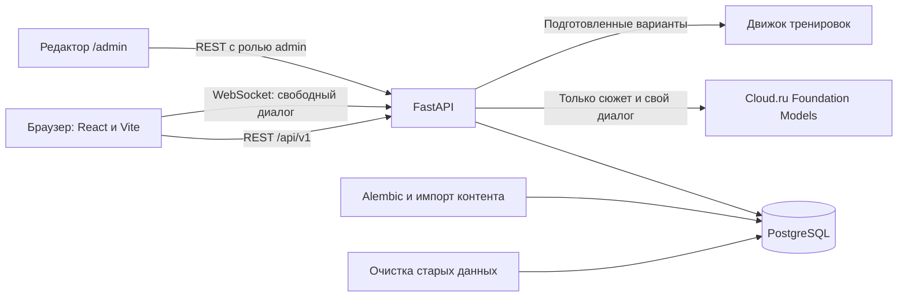

# Архитектура проекта

Актуально для локальной версии от 29 сентября 2026 года. Быстрый запуск описан в [README](../README.md), подробности компонентов — в [документации backend](backend_architecture.md), [frontend](frontend_architecture.md) и [данных](data_architecture.md).

## Сервисы Docker Compose

| Сервис | Работа |
|---|---|
| `db` | PostgreSQL 17, постоянный том `postgres_data` |
| `migrate` | Применяет Alembic до `head`, затем завершается |
| `content-import` | Импортирует редакционные материалы из `backend/content` |
| `demo-seed` | Добавляет демонстрационные сюжет и персонажей |
| `admin-bootstrap` | Создаёт администратора при первом запуске |
| `backend` | FastAPI, игровой движок и AI-клиент |
| `frontend` | React/Vite и прокси `/api` к backend |
| `cleanup` | Удаляет данные по срокам хранения и просроченные записи об отзыве JWT |

## Разделение режимов

- **Сюжет:** подготовленная миссия задаёт контекст и персонажа; игрок пишет ответы. AI оценивает ход, говорит от лица персонажа и проверяет достижение цели. Следующая сюжетная миссия открывается после успешного результата.
- **Свой диалог:** игрок задаёт исходные условия, затем работает тот же свободный AI-диалог.
- **Тренировка:** короткий выбор или пошаговый граф ситуаций с подготовленными ответами, разбором, повтором и финальным ответом для самопроверки. В этом режиме вызов модели не нужен.
- **База знаний:** редакционные материалы, тесты и прогресс чтения.

REST отвечает за авторизацию, каталоги, создание и чтение сессий, редактор и пошаговые тренировки. WebSocket передаёт ходы свободного диалога. Каждая сессия принадлежит пользователю. При выходе JWT отзывается сервером; новые HTTP-запросы и сообщения WebSocket с ним отклоняются.

## Где менять код

| Задача | Папка |
|---|---|
| Экраны и интерфейс | `frontend/src` |
| API авторизации и JWT | `backend/app/auth` |
| Каталоги и пользовательские данные | `backend/app/catalog`, `backend/app/users` |
| Сессии и WebSocket | `backend/app/sessions` |
| Движок, оценка, память, контекст | `backend/app/game` |
| Провайдер модели | `backend/app/ai.py` |
| Редактор и импорт | `backend/app/admin`, `backend/content` |
| Схема БД | `backend/migrations/versions` |

Код не содержит ключ модели. Он читается только из локального `.env`. Публичный API отдаёт сведения для игрока, а скрытый контекст оценки остаётся на сервере.
